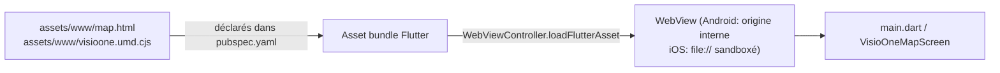
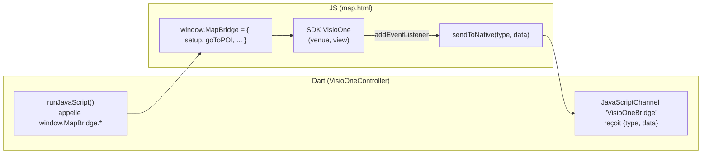
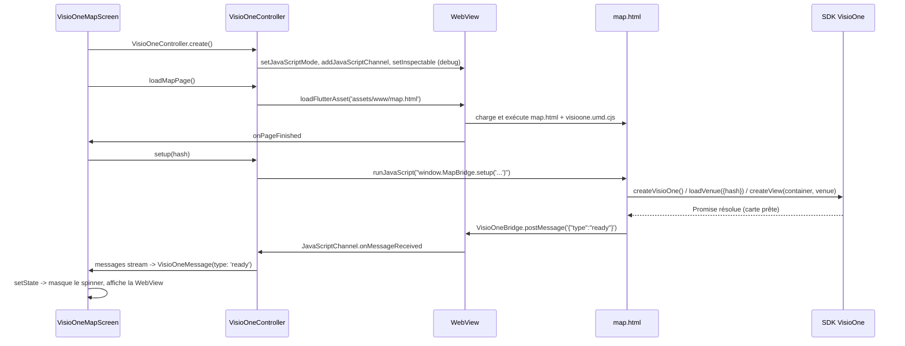

# Architecture — VisioOne dans une app Flutter

## 1. Le problème de fond

Le SDK [`@visioglobe/visioone`](https://www.npmjs.com/package/@visioglobe/visioone) est un SDK **JavaScript/WebGL** (rendu Three.js dans un `<canvas>`). Il n'existe et n'existera pas de portage Dart natif : sur **toutes** les plateformes (Android, iOS, React Native, Flutter), l'intégration consiste à embarquer une `WebView` qui exécute le SDK, et à construire un pont de communication entre le code natif et ce SDK.

Ce document explique les choix faits pour la version Flutter, en s'appuyant sur ce qui a déjà été appris — et parfois découvert à ses dépens — dans les trois autres implémentations du dépôt :

| Projet | Plateforme | WebView | Build du SDK utilisé |
|---|---|---|---|
| `VisioOneMeetAndroid` | Kotlin/Compose | `android.webkit.WebView` + `WebViewAssetLoader` | ESM (`visioone.js`), servi en `https://appassets.androidx.local/...` |
| `VisioOneMeetIos` | Swift/SwiftUI | `WKWebView` | **UMD** (`visioone.umd.cjs`), servi en `file://` |
| `VisioOneMeetRN` | React Native | `react-native-webview` | ESM chargé dynamiquement depuis un **CDN** (`cdn.visioglobe.com`) |
| `VisioOneMeetFlutter` (ce projet) | Dart/Flutter | `webview_flutter` | **UMD** (`visioone.umd.cjs`), vendored, servi via `loadFlutterAsset` |

## 2. Pourquoi le bundle UMD, pas l'ESM

C'est la décision la plus importante du projet, et elle n'est pas arbitraire : elle vient d'un problème réel documenté dans les deux autres implémentations.

- Le build ESM (`dist/visioone.js`) est petit (~8 Ko) mais référence des chunks additionnels chargés par des `import()` dynamiques (ex. `visioOne-*.js`, ~6 Mo). Sous WebKit, des imports de modules ES en `file://` échouent à cause des restrictions CORS appliquées aux modules — c'est documenté explicitement dans `VisioOneMeetIos/docs/INTEGRATION.md` (« Ne pas utiliser `dist/visioone.js`... ce fichier échoue en `file://` »).
- `VisioOneMeetRN` a rencontré une variante du même problème en chargeant l'ESM depuis un CDN plutôt qu'en local (voir les commentaires `DIAGNOSTIC_MODE` dans `App.tsx` et `visioOne.html` : « latest loads a large module graph »), ce qui a nécessité un mode diagnostic dédié pour isoler la cause.
- Le build **UMD** (`dist/visioone.umd.cjs`, ~5 Mo) est un bundle autonome, chargé comme un `<script>` classique (pas `type="module"`). Il ne fait aucun `import()` dynamique et fonctionne donc **indépendamment de l'origine** servant la page (`file://`, `https://`, ou l'origine interne utilisée par `webview_flutter`).

Flutter doit tourner de façon identique sur Android *et* iOS avec le même code JS embarqué (pas de fork par plateforme comme sur Android/iOS natifs) : le bundle UMD est donc le seul choix qui évite de refaire l'enquête déjà menée sur iOS et sur RN.

> Si une future version du SDK ne publie plus de build UMD, la solution de repli est de servir la page via un vrai serveur HTTP local (par ex. via `shelf` embarqué dans l'app, ou l'équivalent de `WebViewAssetLoader` côté Android) plutôt que `file://` — c'est ce qui permet à l'ESM de fonctionner côté Android natif.

## 3. Chargement de la page hôte

`WebViewController.loadFlutterAsset('assets/www/map.html')` (voir [`visio_one_controller.dart`](../lib/visio_one/visio_one_controller.dart)) est l'équivalent Flutter de :
- `WebViewAssetLoader` + `https://appassets.androidx.local/...` côté Android natif,
- `webView.loadFileURL(url, allowingReadAccessTo:)` côté iOS natif.

`map.html` et `visioone.umd.cjs` doivent être dans le **même dossier** (`assets/www/`) : `map.html` référence le second par chemin relatif (`<script src="visioone.umd.cjs">`).

## 4. Le pont de communication

Deux canaux indépendants, inspirés du meilleur de chaque implémentation existante :

- **Native → JS** : `window.MapBridge`, une méthode par commande (`setup`, `goToPOI`, `goToFloor`, `startItinerary`, ...) — repris du pattern documenté dans `VisioOneMeetIos/docs/APP_SDK_COMMUNICATION.md` (« ne jamais appeler `venue`/`view` directement depuis le natif, toujours via un petit objet-pont »). Chaque argument structuré est encodé en JSON (`dart:convert.jsonEncode`) avant d'être interpolé dans le script — jamais de concaténation de texte brut, pour éviter toute injection JS (même mise en garde que le guide iOS).
- **JS → Native** : un seul `JavaScriptChannel` (`VisioOneBridge`), avec une enveloppe `{type, data}` — repris du contrat `{type, data}` de `VisioOneMeetRN/src/screens/map/useVisioMap.ts` plutôt que la méthode-par-événement d'Android (`@JavascriptInterface` avec `onMapReady()`/`onMapError()`), parce qu'un seul canal typé est plus simple à étendre (ajouter un événement = ajouter un `case` côté Dart, pas une nouvelle méthode de pont).

Détail complet, y compris la liste des messages et les pièges de threading : [`COMMUNICATION_GUIDE.md`](COMMUNICATION_GUIDE.md).

## 5. Cycle de vie d'un affichage de carte

## 6. Ce que ce squelette ne couvre pas (volontairement)

Ce projet est un point de départ d'intégration, pas une application produit. Restent hors périmètre, à ajouter selon les besoins de l'app hôte (voir les patterns déjà présents dans `VisioOneMeetRN` pour s'en inspirer, notamment `useVisioMap.ts` et `MapScreenRedesign.tsx`) :

- UI native pilotant la recherche de POI, un tiroir de détails, un sélecteur d'étage natif (le SDK fournit sa propre UI overlay, désactivable partiellement via `setUIPartVisible`) ;
- gestion multi-cartes / changement de site à chaud ;
- authentification (`authorizationToken` de `loadVenue`) pour les cartes privées ;
- récupération et affichage d'un statut d'occupation temps réel (pattern `updateOccupancy` de `VisioOneMeetRN`, déjà câblé côté pont dans ce projet mais sans source de données).
