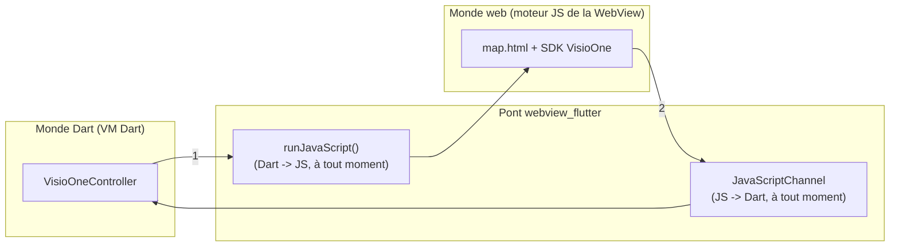

# Pont de communication Dart ↔ SDK VisioOne

Ce document se concentre sur **le pont de communication** entre le code Dart et le SDK JavaScript VisioOne exécuté dans la `WebView`. Il complète [`ARCHITECTURE.md`](ARCHITECTURE.md) (vue d'ensemble) et [`INTEGRATION_GUIDE.md`](INTEGRATION_GUIDE.md) (installer et configurer l'app). Il applique les mêmes principes que les guides de communication équivalents sur les implémentations natives Android et iOS du SDK, adaptés ici à `webview_flutter`.

**Public visé :** développeur Flutter qui doit ajouter, modifier ou déboguer une communication entre l'UI Dart et le SDK VisioOne.

---

## Sommaire

- [1. Deux runtimes qui ne partagent rien](#1-deux-runtimes-qui-ne-partagent-rien)
- [2. Les deux canaux](#2-les-deux-canaux)
- [3. Contrat de messages](#3-contrat-de-messages)
- [4. Cycle de vie complet d'un message](#4-cycle-de-vie-complet-dun-message)
- [5. Lecture du code existant](#5-lecture-du-code-existant)
- [6. Ajouter une nouvelle commande Native → JS](#6-ajouter-une-nouvelle-commande-native--js)
- [7. Ajouter un nouvel événement JS → Native](#7-ajouter-un-nouvel-événement-js--native)
- [8. Le threading](#8-le-threading)
- [9. Sécurité du `JavaScriptChannel`](#9-sécurité-du-javascriptchannel)
- [10. Déboguer le pont](#10-déboguer-le-pont)
- [11. Bonnes pratiques](#11-bonnes-pratiques)

---

## 1. Deux runtimes qui ne partagent rien

Comme sur Android et iOS, l'app fait cohabiter deux environnements d'exécution étanches : la VM Dart (qui exécute `main.dart`, `visio_one_controller.dart`...) et le moteur JavaScript de la `WebView` (qui exécute `map.html` et le SDK). Aucune mémoire partagée : toute communication passe par l'API de `webview_flutter`.



Contrairement au canal ① (query param à l'URL) utilisé par l'implémentation Android native, `runJavaScript()` peut être appelé **à tout moment**, pas seulement au chargement : c'est pour cela que `VisioOneController.setup(hash)` est un appel JS explicite après `onPageFinished`, plutôt qu'un paramètre encodé dans l'URL de `loadFlutterAsset`. Cela permet aussi de rappeler `setup()` avec un nouveau hash sans recharger toute la page (voir `map.html`, `window.MapBridge.setup`, qui détruit proprement l'ancienne vue/venue avant d'en recréer une).

## 2. Les deux canaux

| # | Direction | Mécanisme Flutter | Quand | Utilisé pour |
|---|---|---|---|---|
| ① | Dart → JS | `WebViewController.runJavaScript(script)` | À tout moment | Appeler `window.MapBridge.<methode>(...)` |
| ② | JS → Dart | `WebViewController.addJavaScriptChannel('VisioOneBridge', onMessageReceived: ...)` | À tout moment, déclenché par le JS | Recevoir les événements du SDK (`ready`, `error`, `poiSelected`, ...) |

Les deux canaux sont bidirectionnels et réutilisables (contrairement au query param d'URL, à usage unique) : c'est une différence volontaire avec l'implémentation Android native, rendue possible par le fait que `webview_flutter` expose `evaluateJavascript`-like (`runJavaScript`) comme mécanisme *principal*, alors que `WebView.addJavascriptInterface` seul (utilisé nativement sur Android) ne permet pas nativement l'inverse sans `evaluateJavascript` en plus.

## 3. Contrat de messages

### Native → JS (`window.MapBridge`, dans `assets/www/map.html`)

| Méthode | Arguments (JSON-encodés) | Rôle |
|---|---|---|
| `setup(hash)` | `String` | (Ré)initialise `venue`/`view` pour ce hash. |
| `goToGlobal()` | — | Recentre sur la vue globale du site. |
| `goToPOI(poiId)` | `String` | Centre la caméra sur un POI et le sélectionne. |
| `goToFloor(buildingId, floorId)` | `String`, `String?` | Change de bâtiment/étage. |
| `clearSelection()` | — | Efface la sélection visuelle courante. |
| `startItinerary(args)` | `{origin, destination, isAccessible}` | Calcule et affiche un itinéraire. |
| `setUIPartVisible(part, visible)` | `String`, `bool` | Affiche/masque un élément de l'UI overlay du SDK. |
| `updateOccupancy(occupancy)` | `[{planId, color}]` | Met à jour la couleur d'occupation d'un ou plusieurs POI. |
| `getVenueLayout()` | — | Demande la liste bâtiments/étages ; répond en asynchrone via `venueLayout` (voir ci-dessous). |

### JS → Native (`VisioOneBridge.postMessage`, enveloppe `{type, data}`)

| `type` | `data` | Émis quand |
|---|---|---|
| `pageReady` | — | `map.html` a fini de charger (avant même `setup`) — utile en debug hors WebView. |
| `loading` | `{hash}` | `setup()` vient de démarrer `loadVenue()`. |
| `ready` | — | `createView()` a réussi : la carte est affichée. |
| `error` | `{message}` | `loadVenue()`/`createView()` a échoué. |
| `poiSelected` | `{id, name}` | L'utilisateur a tapé un POI dans la carte (`view` event `poiclick`). |
| `floorChanged` | `{buildingId, floorId}` | Changement d'étage courant (`view` event `currentfloorchanged`). |
| `itineraryComputed` | `{instructions}` | `startItinerary()` a terminé son calcul. |
| `venueLayout` | `{currentBuildingId, currentFloorId, buildings: [{id, defaultFloorId, floors: [{id, levelIndex}]}]}` | Réponse à `getVenueLayout()`. |

Toute évolution de la communication doit commencer par **ajouter une ligne à l'un de ces deux tableaux** avant d'écrire du code — c'est la spécification du pont, à garder synchronisée avec `map.html` et `visio_one_controller.dart`.

## 4. Cycle de vie complet d'un message

Voir le diagramme de séquence dans [`ARCHITECTURE.md`, section 5](ARCHITECTURE.md#5-cycle-de-vie-dun-affichage-de-carte).

## 5. Lecture du code existant

### Dart → JS, avec encodage JSON défensif

```dart
// lib/visio_one/visio_one_controller.dart

Future<void> goToPOI(String poiId) => _call('goToPOI', [poiId]);

Future<void> _call(String method, List<Object?> args) {
  final encodedArgs = args.map(jsonEncode).join(', ');
  return _run('window.MapBridge.$method($encodedArgs)');
}
```

`jsonEncode('B1-UL00-01')` produit le **texte** `"B1-UL00-01"` (avec guillemets et échappement corrects), interpolé dans le script généré : `window.MapBridge.goToPOI("B1-UL00-01")`. Un `poiId` contenant un guillemet ou une séquence `");alert(1);(` ne casse donc jamais le script généré — voir [section 9](#9-sécurité-du-javascriptchannel).

> ⚠️ **Point important, source d'un bug réel rencontré pendant le développement de ce projet** : ce texte JSON est ensuite **évalué comme du code JS** par le moteur qui exécute le script (`runJavaScript`), pas relu comme une chaîne par la fonction JS appelée. Le paramètre `poiId` reçu par `window.MapBridge.goToPOI` est donc déjà la vraie valeur JS (`"B1-UL00-01"` sans les guillemets — une string JS normale), **pas** du texte JSON à repasser dans `JSON.parse()`. Le premier jet de ce projet appelait par erreur `JSON.parse(poiId)` côté JS (et pareil pour tous les autres paramètres) : pour un simple hash de carte comme `k5f59b86...`, ce n'est pas du JSON valide, donc `JSON.parse` levait un `SyntaxError` — attrapé nulle part, ce qui laissait l'app bloquée indéfiniment sur l'écran de chargement, sans jamais émettre `ready` ni `error`. Toujours utiliser directement le paramètre reçu côté JS, jamais `JSON.parse` sur un argument de `window.MapBridge.*`.

### JS → Dart, réception typée

```dart
// lib/visio_one/visio_one_controller.dart

await _webViewController.addJavaScriptChannel(
  kVisioOneBridgeChannel, // 'VisioOneBridge'
  onMessageReceived: _handleRawMessage,
);

void _handleRawMessage(JavaScriptMessage message) {
  final parsed = VisioOneMessage.tryParse(message.message);
  if (parsed == null) {
    debugPrint('VisioOneController: message JS illisible: ${message.message}');
    return;
  }
  _messages.add(parsed);
}
```

```javascript
// assets/www/map.html

function sendToNative(type, data) {
  var bridge = window.VisioOneBridge;
  if (!bridge) { console.log('[VisioOne:web]', type, data); return; }
  bridge.postMessage(JSON.stringify({ type: type, data: data }));
}
```

Le garde `if (!bridge)` n'est pas cosmétique : si `map.html` est ouvert dans un navigateur classique (`npm run dev`/`live-server` pour itérer sur le HTML sans relancer l'app Flutter), `window.VisioOneBridge` n'existe pas — sans ce garde, `sendToNative` planterait hors de l'app.

## 6. Ajouter une nouvelle commande Native → JS

**Étape 1 — Ajouter une ligne au tableau Native → JS** (section 3) : nom de la méthode, arguments, rôle.

**Étape 2 — Implémenter la méthode dans `window.MapBridge`** (`assets/www/map.html`) :

```javascript
window.MapBridge.maFonction = function (arg) {
  // `arg` est déjà la vraie valeur JS (string/bool/objet) — ne pas JSON.parse()
  // ici, voir l'avertissement de la section 5.
  // ... logique utilisant venue / view ...
};
```

**Étape 3 — Exposer un appel Dart typé** (`visio_one_controller.dart`) :

```dart
Future<void> maFonction(String arg) => _call('maFonction', [arg]);
```

**Étape 4 — Tester** en conditions réelles dans la WebView (voir [section 10](#10-déboguer-le-pont)), pas seulement en relisant le code : une erreur de nom de méthode ou d'argument JS échoue silencieusement (voir [section 8](#8-le-threading) sur la gestion d'erreur de `_run`).

## 7. Ajouter un nouvel événement JS → Native

**Étape 1 — Ajouter une ligne au tableau JS → Native** (section 3) : `type`, forme de `data`, événement SDK déclencheur.

**Étape 2 — Émettre l'événement depuis `map.html`**, généralement via `view.addEventListener(...)` (voir la liste complète des événements dans `EventType.d.ts`, livré avec le package npm) :

```javascript
view.addEventListener('selectedpoischange', function (event) {
  sendToNative('selectionChanged', { count: event.pois.length });
});
```

**Étape 3 — Ajouter un `case` dans le consommateur Dart** (`lib/visio_one/visio_one_map_shell.dart`, méthode `_onMessage`), ou dans tout autre widget qui écoute `controller.messages` :

```dart
case 'selectionChanged':
  final count = (message.data as Map)['count'] as int;
  // ...
```

## 8. Le threading

Contrairement à l'implémentation Android **native** (Kotlin, `@JavascriptInterface`), où les callbacks JS → natif arrivent sur un thread d'arrière-plan et nécessitent un repost explicite (`Handler(Looper.getMainLooper()).post { ... }` — même leçon documentée sur le guide de communication équivalent côté Android natif), le callback `onMessageReceived` d'un `JavaScriptChannel` Flutter est délivré **sur l'isolate Dart racine**, au même titre que n'importe quel autre événement asynchrone (`Future`, `Stream`). Appeler `setState()` directement dans `_handleRawMessage`/`_onMessage` est donc sûr, **sans** repost manuel — `webview_flutter` absorbe ce détail de plateforme pour vous, sur Android comme sur iOS.

Le seul threading à garder en tête concerne `runJavaScript()` : c'est un appel asynchrone (`Future<void>`/`Future<Object?>`) qui traverse un platform channel — ne jamais supposer que le script s'est exécuté avant d'avoir `await` le futur (ou, pour les cas où le résultat n'est pas nécessaire, avant le prochain tick).

## 9. Sécurité du `JavaScriptChannel`

- **Le `JavaScriptChannel` n'est enregistré que sur la `WebView` qui charge `assets/www/map.html`**, jamais sur une `WebView` affichant une URL arbitraire. Ne réutilisez pas la même instance de `WebViewController`/`VisioOneController` pour afficher du contenu non maîtrisé (ex. un lien externe cliqué par l'utilisateur) sans reconsidérer ce que ce contenu peut appeler.
- **Toujours encoder en JSON les arguments Dart → JS** (voir [section 5](#5-lecture-du-code-existant)) : même si `poiId` semble provenir d'une source interne fiable aujourd'hui, rien ne garantit qu'il continuera à l'être (ex. si le jour où un `poiId` provient d'une saisie utilisateur ou d'une réponse serveur). Ne jamais revenir à `'window.MapBridge.goToPOI(\'$poiId\')'` en interpolation brute.
- **Limiter le pont au strict nécessaire** : chaque méthode `window.MapBridge.*` est une méthode que *tout* JavaScript exécuté dans cette WebView peut appeler (le SDK VisioOne lui-même, mais aussi un `<script>` externe si `map.html` venait à charger du contenu tiers) — n'exposez que ce dont l'app hôte a réellement besoin.

## 10. Déboguer le pont

### Console JS directement dans les logs Dart

En mode debug, `VisioOneController._initialize` appelle `WebViewController.setOnConsoleMessage(...)`, qui relaie tout `console.log`/`console.warn`/`console.error` exécuté dans `map.html` (y compris par le SDK lui-même) vers `debugPrint`, donc directement dans la sortie de `flutter run` (`flutter: VisioOne[console.error]: ...`). C'est le premier réflexe à avoir avant de sortir Chrome DevTools ou Safari : dans la plupart des cas (dont le bug `JSON.parse` documenté en section 5), le message d'erreur JS suffit à comprendre le problème sans quitter le terminal.

### Android

```bash
# Rien à activer côté Dart : AndroidWebViewController.enableDebugging(true)
# est déjà appelé automatiquement en mode debug, voir VisioOneController.create().
```
Puis, sur l'ordinateur : Chrome → `chrome://inspect#devices` → la WebView de l'app apparaît dans la liste (le détail est identique côté Flutter).

### iOS

`WebKitWebViewController.setInspectable(true)` est de même appelé automatiquement en debug (voir `VisioOneController._initialize`). Sur iOS 16.4+ : Safari → **Développement** → *nom du simulateur/appareil* → `map.html` — DevTools complètes (console, DOM, réseau).

Dans les deux cas, vous pouvez appeler manuellement `window.VisioOneBridge.postMessage('{"type":"ready"}')` depuis la console pour vérifier que le pont réagit côté Dart, ou poser un `console.log` dans `map.html` pour tracer l'exécution du SDK.

## 11. Bonnes pratiques

- **Le contrat de messages (section 3) est la source de vérité** — tenez-le à jour à chaque ajout/retrait, avant même d'écrire le code.
- **Toujours un accès défensif côté JS** (`window.VisioOneBridge?.postMessage` / `if (!bridge)`) pour ne pas dépendre de l'environnement d'exécution (WebView Flutter vs navigateur de dev).
- **Toujours encoder les arguments Dart → JS en JSON**, jamais de concaténation de texte brut.
- **Ne jamais bloquer sur `runJavaScript()`** dans un chemin critique de l'UI sans `await` ni gestion d'erreur (voir `VisioOneController._run`, qui logue et continue plutôt que de faire planter l'app sur une commande JS ratée).
