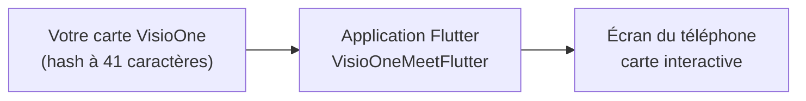

# Guide d'intégration VisioOneMeetFlutter — pas à pas pour intégrateur

Ce guide s'adresse à toute personne chargée d'installer, compiler et personnaliser cette application. Une familiarité de base avec la ligne de commande est utile ; une expérience préalable de Flutter/Dart ne l'est pas pour les cas d'usage courants (changer de carte, changer le nom/l'icône de l'app).

**Temps estimé :** 45–75 minutes la première fois (installation des outils comprise), 5 minutes ensuite pour reconfigurer une nouvelle carte.

**Ce dont vous avez besoin avant de commencer :**
- Un Mac (requis pour builder/tester la cible iOS ; Windows/Linux suffisent pour Android seul).
- Un compte sur [my.visioglobe.com](https://my.visioglobe.com) avec au moins une carte déjà « buildée » (sinon, contactez votre interlocuteur Visioglobe).
- Un smartphone Android et/ou iOS (idéal), ou un émulateur/simulateur.

---

## Sommaire

- [Partie A — Comprendre le principe en 2 minutes](#partie-a--comprendre-le-principe-en-2-minutes)
- [Partie B — Installer les outils](#partie-b--installer-les-outils)
- [Partie C — Récupérer le projet](#partie-c--récupérer-le-projet)
- [Partie D — Obtenir le hash de votre carte](#partie-d--obtenir-le-hash-de-votre-carte)
- [Partie E — Configurer la carte à afficher](#partie-e--configurer-la-carte-à-afficher)
- [Partie F — Récupérer/mettre à jour le SDK VisioOne](#partie-f--récupérermettre-à-jour-le-sdk-visioone)
- [Partie G — Installer les dépendances Flutter](#partie-g--installer-les-dépendances-flutter)
- [Partie H — Lancer l'application](#partie-h--lancer-lapplication)
- [Partie I — Vérifier que tout fonctionne](#partie-i--vérifier-que-tout-fonctionne)
- [Partie J — Dépannage](#partie-j--dépannage)
- [Partie K — Personnalisations courantes](#partie-k--personnalisations-courantes)
- [Glossaire](#glossaire)

---

## Partie A — Comprendre le principe en 2 minutes

1. **L'application est une coquille Flutter** qui affiche une seule chose : une carte VisioOne, en plein écran, dans une `WebView`.
2. **La carte elle-même est un site web** (le SDK `@visioglobe/visioone`, en JavaScript) que l'on encapsule dans l'application. On ne réécrit jamais ce SDK — on télécharge son bundle depuis `npm` et on l'embarque tel quel dans les assets Flutter.
3. **Une seule information permet de choisir quelle carte s'affiche : le « hash »**, une chaîne de 41 caractères propre à chaque carte publiée sur my.visioglobe.com.



Intégrer votre propre carte revient à : récupérer votre hash (Partie D), l'indiquer à l'application (Partie E), puis compiler et lancer (Parties G–H). Aucune de ces étapes ne demande d'écrire du nouveau code Dart.

---

## Partie B — Installer les outils

### B1. Flutter SDK

```bash
brew install --cask flutter   # macOS ; voir https://docs.flutter.dev/get-started/install pour Windows/Linux
flutter doctor
```

✅ **Vérification :** `flutter doctor` liste les composants disponibles (Flutter, Android toolchain, Xcode...). Des `!`/`✗` sur des composants dont vous n'avez pas besoin (ex. Windows/Linux desktop) ne sont pas bloquants ; concentrez-vous sur la ligne **Android toolchain** et/ou **Xcode** selon votre cible.

### B2. Android Studio (pour cibler Android)

Identique aux autres intégrations natives du SDK VisioOne. En résumé : installez Android Studio, ouvrez **Tools → SDK Manager**, cochez une plateforme récente (API 34+).

### B3. Xcode (pour cibler iOS, macOS uniquement)

```bash
xcodebuild -version   # doit afficher une version, pas "command not found"
sudo xcode-select --install   # si nécessaire, installe les Command Line Tools
```

Puis, une seule fois : ouvrez Xcode, acceptez la licence, laissez l'installation des composants additionnels se terminer.

### B4. Node.js (pour récupérer le SDK VisioOne)

```bash
node -v
npm -v
```

✅ **Vérification :** les deux commandes affichent un numéro de version.

### B5. Un moyen de tester l'application

- **Téléphone physique** : activez le mode développeur (Android) ou la confiance développeur (iOS), connectez en USB.
- **Émulateur/simulateur** : Android Studio → *Device Manager* → créez un appareil ; ou, sur Mac, `open -a Simulator`.

---

## Partie C — Récupérer le projet

```bash
cd VisioOneMeetFlutter
ls
```

✅ **Vérification :** vous devez voir `lib/`, `assets/`, `android/`, `ios/`, `pubspec.yaml` parmi les résultats.

---

## Partie D — Obtenir le hash de votre carte

Comme pour les autres intégrations du SDK : connectez-vous sur [my.visioglobe.com](https://my.visioglobe.com), ouvrez votre carte (déjà « buildée »), et copiez le **hash** — une chaîne de 41 caractères alphanumériques, ex. :

```
k5f59b8615f0379390e03e4cbe893ff813b9ac94a
```

> **Vous ne trouvez pas le hash ?** Demandez explicitement « le hash de build de la carte » à votre contact Visioglobe, pas juste « le lien de la carte ».

---

## Partie E — Configurer la carte à afficher

1. Ouvrez `lib/main.dart`.
2. Repérez cette ligne, tout en haut du fichier :

   ```dart
   const String kDefaultMapHash = 'k5f59b8615f0379390e03e4cbe893ff813b9ac94a';
   ```

3. Remplacez la chaîne entre guillemets par votre hash (Partie D), guillemets simples conservés :

   ```dart
   const String kDefaultMapHash = 'VOTRE_HASH_ICI';
   ```

4. Enregistrez.

✅ **Vérification :** la ligne modifiée contient bien vos 41 caractères entre guillemets, sans espace superflu.

> **C'est la seule modification de code nécessaire** pour afficher votre propre carte. Aucun rebuild du bundle web (Partie F) n'est requis pour ce changement — contrairement à une mise à jour du SDK lui-même.

---

## Partie F — Récupérer/mettre à jour le SDK VisioOne

Cette partie n'est nécessaire que si vous installez le projet pour la première fois (le bundle est déjà présent dans `assets/www/`) ou si vous voulez changer de version du SDK.

```bash
npm pack @visioglobe/visioone
tar xzf visioglobe-visioone-*.tgz
cp package/dist/visioone.umd.cjs assets/www/visioone.umd.cjs
rm -rf package visioglobe-visioone-*.tgz
```

✅ **Vérification :** `assets/www/visioone.umd.cjs` existe et pèse plusieurs Mo (≈5 Mo pour la version 1.0.5).

> **Pourquoi `npm pack` et pas `npm install` ?** On ne construit rien avec un bundler (pas de Vite/Webpack ici, contrairement à une intégration native Android) : on récupère juste le fichier UMD déjà construit par Visioglobe, tel quel. Voir [`ARCHITECTURE.md`, section 2](ARCHITECTURE.md#2-pourquoi-le-bundle-umd-pas-lesm) pour pourquoi ce fichier précis (et pas `dist/visioone.js`).

Pour choisir une version précise plutôt que la dernière :

```bash
npm pack @visioglobe/visioone@1.0.5
```

---

## Partie G — Installer les dépendances Flutter

```bash
flutter pub get
```

✅ **Vérification :** se termine par `Got dependencies!` sans ligne d'erreur rouge.

---

## Partie H — Lancer l'application

1. Branchez un appareil ou démarrez un émulateur/simulateur.
2. Listez les cibles disponibles :

   ```bash
   flutter devices
   ```

3. Lancez :

   ```bash
   flutter run
   ```

   Ou, pour une cible précise :

   ```bash
   flutter run -d <device-id>
   ```

**Alternative — build sans lancer**, utile en CI ou pour générer un fichier installable :

```bash
flutter build apk --debug          # Android, débogage
flutter build ios --debug --no-codesign   # iOS, débogage (nécessite un compte Apple pour tester sur device réel)
```

---

## Partie I — Vérifier que tout fonctionne

À l'ouverture, vous devez voir dans l'ordre :

1. Un écran noir avec un **indicateur de chargement** au centre.
2. **Patientez 20–30 secondes** au premier lancement — le temps que l'appareil télécharge les données 3D de la carte depuis `mapserver.visioglobe.com`. Ce n'est pas un blocage.
3. La carte apparaît : bâtiments, sélecteur d'étage, barre de recherche (fournis par l'UI overlay du SDK).

| Ce que vous voyez | Signification |
|---|---|
| Indicateur qui tourne depuis moins de 30 s | Normal, patientez |
| Indicateur qui tourne depuis plus de 2 minutes | Problème réseau ou hash incorrect — voir Partie J |
| Message « Impossible de charger la carte VisioOne » | Le hash est probablement invalide — revérifiez la Partie E |
| Carte affichée avec bâtiments et étages | ✅ Tout fonctionne |

---

## Partie J — Dépannage

| Symptôme | Cause probable | Solution |
|---|---|---|
| `flutter: command not found` | Flutter non installé ou terminal pas redémarré | Réinstallez (Partie B1), fermez/rouvrez le terminal |
| `flutter doctor` signale l'Android toolchain en erreur | SDK/licences Android manquants | `flutter doctor --android-licenses`, acceptez toutes les licences |
| Build iOS échoue avec une erreur CocoaPods | Pods pas installés/à jour | `cd ios && pod install && cd ..`, puis relancez |
| Écran noir permanent, aucun indicateur | `assets/www/map.html` ou `visioone.umd.cjs` absent des assets | Vérifiez `pubspec.yaml` (`assets: - assets/www/`) puis `flutter clean && flutter pub get` |
| Message « Impossible de charger la carte VisioOne » avec message réseau | Pas de connexion internet sur l'appareil, ou hash invalide | Vérifiez le Wi-Fi/données mobiles, puis revérifiez le hash (Partie D/E) |
| L'appareil physique n'apparaît pas dans `flutter devices` | Débogage USB (Android) ou confiance développeur (iOS) non activé | Activez-le dans les réglages de l'appareil, acceptez la popup côté appareil |
| Erreur de version Gradle/Kotlin au build Android | Toolchain locale désynchronisée de celle attendue par le plugin `webview_flutter_android` | `flutter clean`, vérifiez `flutter doctor`, mettez à jour Android Studio |

Si aucune de ces solutions ne résout le problème, lancez `flutter run -v` (verbeux) et notez le message d'erreur complet avant de contacter votre interlocuteur Visioglobe.

---

## Partie K — Personnalisations courantes

Ne nécessitent **pas** de rebuild du bundle web (Partie F) :

- **Changer de carte** : reprenez la Partie E avec un nouveau hash.
- **Nom de l'application** : `CFBundleName` dans `ios/Runner/Info.plist` (iOS) et `android:label` dans `android/app/src/main/AndroidManifest.xml` (Android).
- **Icône de l'application** : remplacez les fichiers sous `ios/Runner/Assets.xcassets/AppIcon.appiconset/` et `android/app/src/main/res/mipmap-*/`, ou utilisez un package comme [`flutter_launcher_icons`](https://pub.dev/packages/flutter_launcher_icons).
- **Couleur de fond pendant le chargement** : `Colors.black` dans `lib/visio_one/visio_one_map_screen.dart`.
- **Éléments de l'UI overlay du SDK visibles** (recherche, sélecteur d'étage...) : appelez `controller.setUIPartVisible('search', false)` (voir [`COMMUNICATION_GUIDE.md`](COMMUNICATION_GUIDE.md)).

Nécessitent de refaire la Partie F **avant** de relancer l'app :

- **Mettre à jour la version du SDK VisioOne**.
- **Modifier le comportement au chargement de la carte** (`assets/www/map.html`) — un simple `flutter run`/hot restart suffit ensuite, la modification d'un asset ne nécessite pas de rebuild natif complet.

---

## Glossaire

| Terme | Signification |
|---|---|
| **Hash** | Identifiant unique à 41 caractères d'une carte VisioOne publiée, obtenu sur my.visioglobe.com |
| **WebView** | Composant qui affiche des pages web à l'intérieur d'une application native ; `webview_flutter` en est l'abstraction Flutter |
| **Bundle UMD** | Format de module JavaScript autonome, chargeable via un `<script>` classique, sans bundler ni `import()` dynamique |
| **Asset Flutter** | Fichier embarqué dans l'app et déclaré dans `pubspec.yaml` (`assets:`), accessible via `loadFlutterAsset`/`rootBundle` |
| **Pod / CocoaPods** | Gestionnaire de dépendances natives iOS, utilisé sous le capot par les plugins Flutter (dont `webview_flutter_wkwebview`) |
| **npm** | Gestionnaire de paquets JavaScript/Node.js, utilisé ici pour récupérer le SDK VisioOne |
